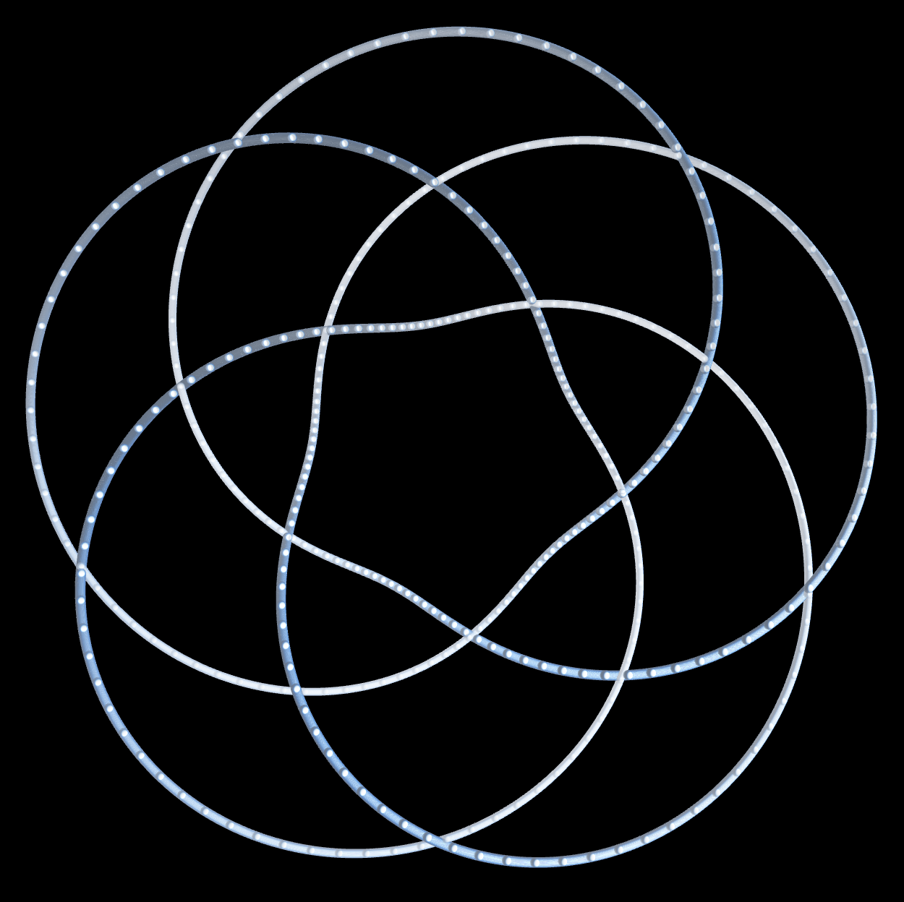

# artworks-p5
key words: p5.js, generative art, creative coding

[**Check out My Artwroks**](https://openprocessing.org/user/283873?o=6&view=sketches)(link to OpenProcessing.org)

https://github.com/hiroshi-kuriyama/artworks-p5/assets/29877317/1e8d6e57-007d-4f41-bcea-ecbe175b569d

https://user-images.githubusercontent.com/29877317/131243317-b93f3343-2aeb-40e2-8c0f-0c207065d5b1.mp4

| | | |
|---|---|---|
||||
