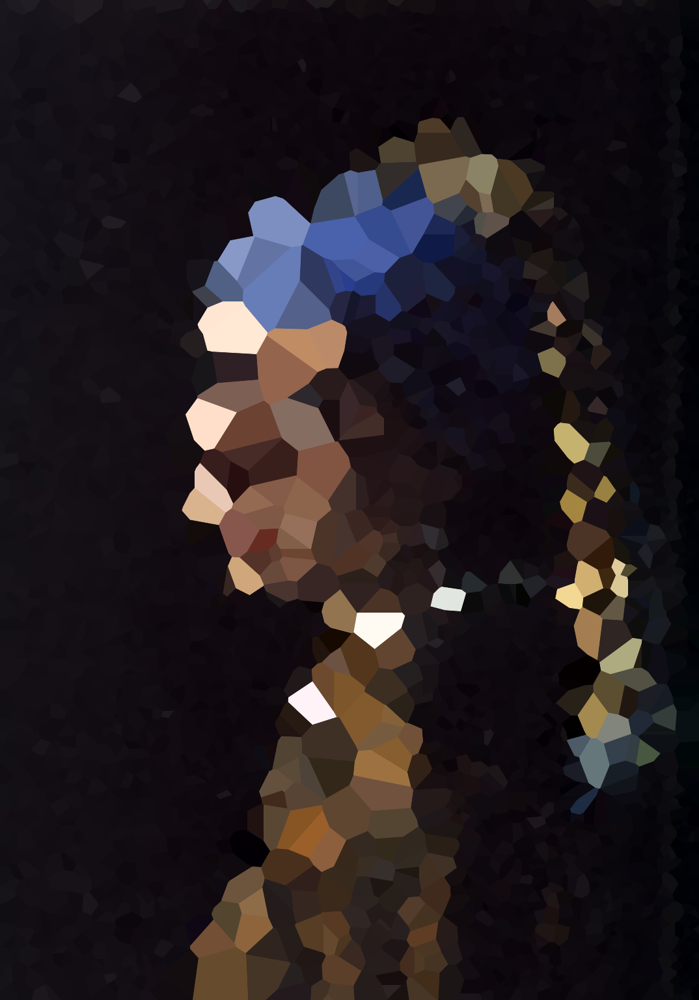

# Voronoi Face

Applying voronoi diagram on a portrait image. The cells are picked up by a random variable which is depends on image brightness.

demo: [Voronoi Face](https://openprocessing.org/sketch/1248703)

