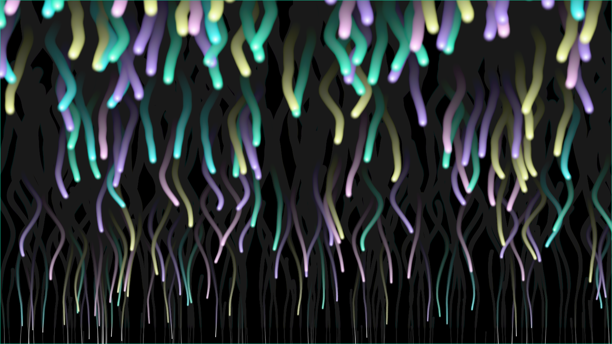

# NEON CURTAIN

Neon lights fall down in the dark. 
Each light oscillate randomly and gets its size and oscillation width  smaller as it goes down. 

demo: [https://openprocessing.org/sketch/1259613](https://openprocessing.org/sketch/1259613)

https://user-images.githubusercontent.com/29877317/132950124-9a7985a5-1270-41ef-8e2a-ca93cf0de5ef.mov

