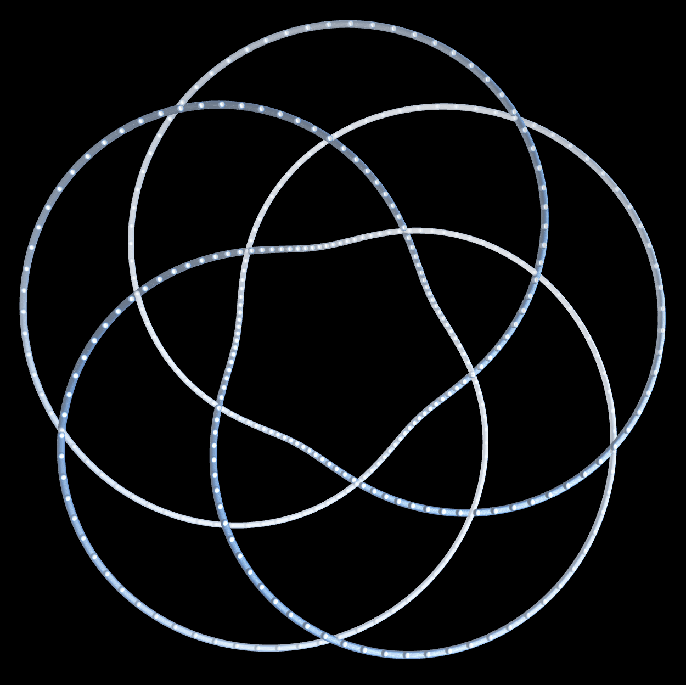

# Crawling on Torus Surface

Plot spheres on a torus surface. Move parameters to change the orbital.
Refresh to shuffle the parameters.

demo: [https://openprocessing.org/sketch/1378436](https://openprocessing.org/sketch/1378436)

https://user-images.githubusercontent.com/29877317/144692061-d7f4ccfb-0537-4547-8f98-7c58cda13d5a.mov