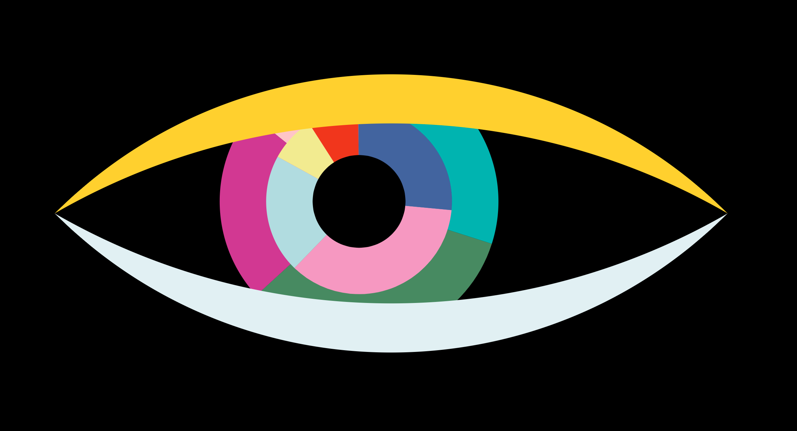
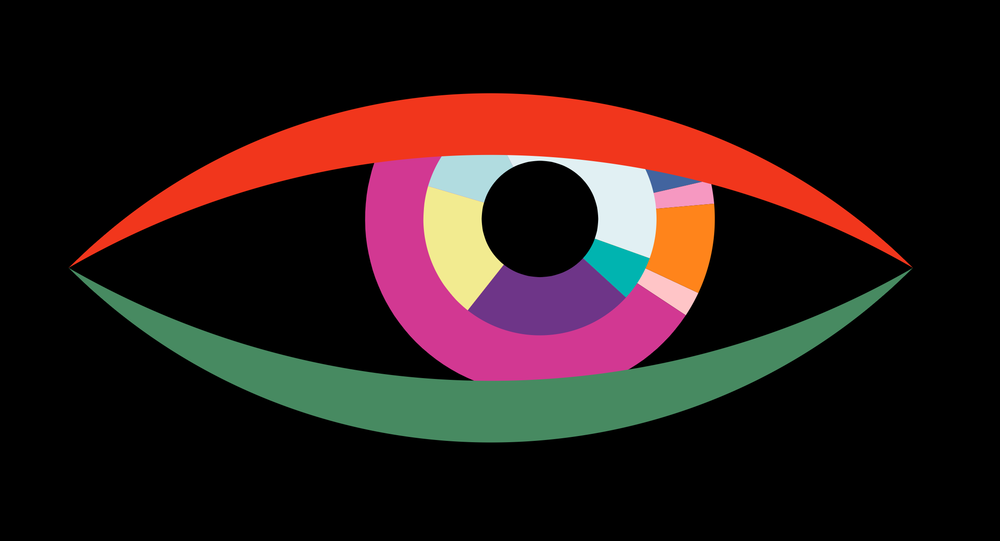

# Don't Look at Me
This artwork utilizes facial detection through an integrated camera system to detect the position of the viewer's face and aligns it with the detected location of the pupils. As a result, the gaze of the artwork follows the movement of the viewer's face, creating an interactive experience.

The viewers not only observe the artwork but are also observed by it, establishing a reciprocal visual connection.

Furthermore, the design of the eyes changes randomly, adding an element of unpredictability to the experience.

| | |
|---|---|
|Sample Image 00|Sample Image 01|
|||

demo: [https://openprocessing.org/sketch/1923545](https://openprocessing.org/sketch/1923545)

https://github.com/hiroshi-kuriyama/artworks-p5/assets/29877317/1e8d6e57-007d-4f41-bcea-ecbe175b569d

